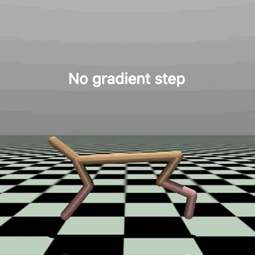
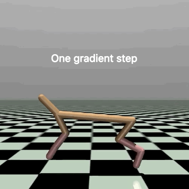

# Reinforcement Learning with Model-Agnostic Meta-Learning (MAML) in TensorFlow 2 (TF2)

<p align="center"> 


</p>

Implementation of *Model-Agnostic Meta-Learning (MAML)* applied on Reinforcement Learning problems in TensorFlow 2. 

This repo is heavily inspired by the original implementation [cbfinn/maml_rl](https://github.com/cbfinn/maml_rl/) (TensorFlow 1.x) as well as the fantastic implementations of Tristan Deleu ([tristandeleu/pytorch-maml-rl](https://github.com/tristandeleu/pytorch-maml-rl) (PyTorch)) and Jonas Rothfuss ([jonasrothfuss/ProMP](https://github.com/jonasrothfuss/ProMP) (TensorFlow 1.x)). 

I totally recommend to check out all three implementations too.

## Usage
You can use the [`main.py`](main.py) script in order to train the algorithm with MAML.
```
python main.py --env-name 2DNavigation-v0 --num-workers 20 --fast-lr 0.1 --max-kl 0.01 --fast-batch-size 20 --meta-batch-size 40 --num-layers 2 --hidden-size 100 --num-batches 500 --gamma 0.99 --tau 1.0 --cg-damping 1e-5 --ls-max-steps 15
```
This script was tested with Python 3.6.

## Work in Progress
The original MAML algorithm for RL which uses [TRPO](https://spinningup.openai.com/en/latest/algorithms/trpo.html) as optimization method can already be used. Tests with *2DNavigation-v0* and *HalfCheetahDir-v1* environments yield the same results as the original paper. 

- Examples, experiment scripts and more environments (i.e. [MetaWorld](https://github.com/rlworkgroup/metaworld)) will follow. 

- TF2 graph support with *'tf.function'* will be added soon. 

- In the future more variations like [CAVIA](https://github.com/lmzintgraf/cavia), [ProMP](https://github.com/jonasrothfuss/ProMP), etc. will be implemented also.

## References
This project is, for the most part, a reproduction of the original implementation [cbfinn/maml_rl](https://github.com/cbfinn/maml_rl/) in TensorFlow 2. The experiments are based on the paper
> Chelsea Finn, Pieter Abbeel, and Sergey Levine. Model-agnostic meta-learning for fast adaptation of deep
networks. _International Conference on Machine Learning (ICML)_, 2017 [[ArXiv](https://arxiv.org/abs/1703.03400)]

If you want to cite this paper
```
@article{DBLP:journals/corr/FinnAL17,
  author    = {Chelsea Finn and Pieter Abbeel and Sergey Levine},
  title     = {Model-{A}gnostic {M}eta-{L}earning for {F}ast {A}daptation of {D}eep {N}etworks},
  journal   = {International Conference on Machine Learning (ICML)},
  year      = {2017},
  url       = {http://arxiv.org/abs/1703.03400}
}
```
